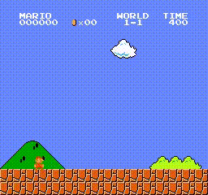

# DI-adventure

Decision intelligence adventure for beginners, have fun and explore it!

# Adventure List
|  No  |                Environment               |                 Algorithm               |         Visualization            |                   Docs and Related Links                   |
| :--: | :--------------------------------------: | :---------------------------------: | :--------------------------------:|:---------------------------------------------------------: |
|  1   |       [mario](https://github.com/Kautenja/gym-super-mario-bros)    | [DQN](https://storage.googleapis.com/deepmind-media/dqn/DQNNaturePaper.pdf)   |      |  [DQN doc](https://di-engine-docs.readthedocs.io/en/latest/12_policies/dqn.html) [DQN中文文档](https://di-engine-docs.readthedocs.io/zh_CN/latest/12_policies/dqn_zh.html)|

# License
DI-adventure is released under the Apache 2.0 license.
