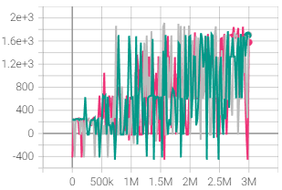
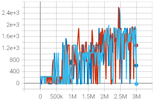
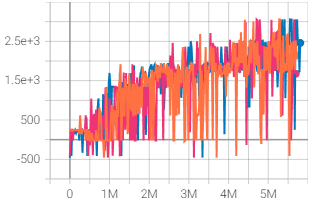
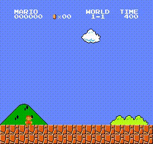
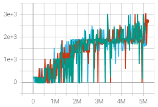
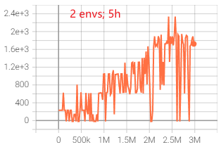
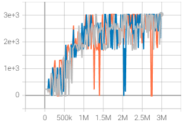
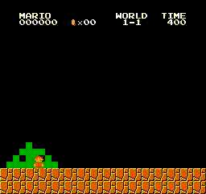

# 一些实验结果，供大家参考，持续更新中
|  No  |  游戏版本   |   观测空间  |   动作空间       |     奖励空间      |   其它 | 评估性能曲线 | 可视化  |
| :---:  | :-----------:     | :--------: | :---------------: | :-----------------: | :---------: |:---------: | :----------: |
|  1   |  v0             |  1 frame   | `SIMPLE MOVEMENT`  | origin | on Server | ||
|  2   |  v0             |  1 frame   | `[[right],[right, A]]`  | origin | on Server | ||
|  3   |  v0             |  4 frames   | `SIMPLE MOVEMENT`  | origin | on Server | ||
|  4   |  v0             |  4 frames   | `[[right],[right, A]]`  | origin | on Server | ||
|  5   |  v0             |  4 frames   | `[[right],[right, A]]`  | origin | Windows Notebook | ||
|  6   |  v1             |  4 frames   | `[[right],[right, A]]`  | origin | on Server | ||