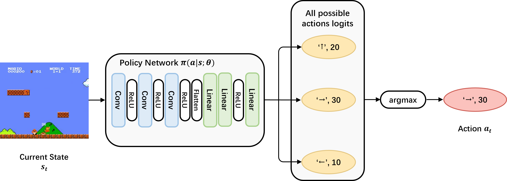

# 强化学习大作业代码配置与运行
> 同学们不要对于RL背后的数学原理和复杂的代码逻辑感到困扰，首先是本次大作业会很少涉及到这一部分，仓库中对这一部分都有着良好的封装；其次是有问题（原理或者代码实现上的）可以随时提问一起交流，方式包括但不限于：
> - github issue: https://github.com/opendilab/DI-adventure/issues
> - 课程微信群
> - 开发者邮箱: opendilab@pjlab.org.cn

## 1. Baseline 代码获取与环境安装
> mario环境的安装教程在网络学堂上，可以自行取用，需要注意：
> 1. 请选择3.8版本的python以避免不必要的版本问题；
> 2. 通过键盘与环境交互需要有可以用于渲染的显示设备，大部分服务器不能胜任，可以选择本地设备或者暂时跳过这一步，对后面没有影响；
> 3. GPU服务器对于强化学习大作业是必须的，如果没有足够的计算资源（笔记本电脑可能难以承担）可能无法顺利完成所有实验；
### 深度学习框架 PyTorch 安装
这一步有网上有非常多的教程，请自行搜索学习，这里不予赘述。
> 请安装 1.10.0 版本以避免不必要的环境问题
### opencv-python 安装
- 在对特征空间的修改中需要对马里奥游戏传回的图像进行处理，代码中使用的是 OpenCV 工具包，安装方法如下
```bash
pip install opencv-python
```
### Baseline 代码获取
- 这次课程专门创建了 DI-advanture 仓库作为算法 baseline，推荐通过以下方式获取：
```bash
git clone https://github.com/opendilab/DI-adventure
```
如果出现网络问题，也可以直接去到 DI-advanture 的仓库手动下载后解压。这样做的缺陷是需要手动初始化 git 与设置远端仓库地址：
```bash
# 如果您是通过手动解压的方式才需要执行以下内容
git init
git add * && git commit -m 'init repo'
git remote set-url origin https://github.com/opendilab/DI-adventure.git
```
推荐使用 git 作为代码管理工具，记录每一次的修改，推荐 [git 教程](https://www.liaoxuefeng.com/wiki/896043488029600)。
### 强化学习库 DI-engine 安装
- 由于这次大作业的目标不是强化学习算法，因此代码中使用了开源强化学习库 DI-engine 作为具体的强化学习算法实现，安装方法如下：
```bash
# clone主分支到本地
git clone https://github.com/opendilab/DI-engine.git
cd DI-engine
git checkout 4c607d400d3290a27ad1e5b7fa8eeb4c2a1a4745
pip install -e .
```
- (OPTIONAL)由于DI-adventure在不断更新，如果您目前使用的是老版本的DI-adventure，可能需要通过以下方式同步更新：
```bash
# 1. 更新DI-engine
cd DI-engine
git pull origin main
git checkout 4c607d400d3290a27ad1e5b7fa8eeb4c2a1a4745
pip install -e .
# 2. 更新DI-adventure
cd DI-adventure
# 确认'origin'指向远端仓库‘git@github.com:opendilab/DI-adventure.git’
git remote -v
# 以下这步如果出现各种例如merge conflict问题，可以借助互联网或咨询助教帮助解决。
# 或者直接重新安装DI-adventure，注意保存自己的更改。
git pull origin main
```
- 修改 gym 版本
```bash
# DI-engine这里可能会将gym版本改为0.25.2，需要手动改回来
pip install gym==0.25.1
```
- 安装grad-cam以保存CAM（Class Activation Mapping，类别激活映射图）
```bash
pip install grad-cam
```
## 2. Baseline 代码运行
- 项目结构
```bash
.
├── LICENSE
├── mario_dqn                               --> 本次大作业相关代码：利用DQN算法训练《超级马里奥兄弟》智能体
│   ├── assets
│   │   ├── dqn.png                         --> 流程示意图
│   │   └── mario.gif                       --> mario游戏gif示意图
│   ├── evaluate.py                         --> 智能体评估函数
│   ├── __init__.py
│   ├── mario_dqn_main.py                   --> 智能体训练入口，包含训练的逻辑
│   ├── mario_dqn_config.py                 --> 智能体配置文件，包含参数信息       
│   ├── model.py                            --> 神经网络结构定义文件
│   ├── policy.py                           --> 策略逻辑文件，包含经验收集、智能体评估、模型训练的逻辑
│   ├── README.md
│   ├── requirements.txt                    --> 项目依赖目录
│   └── wrapper.py                          --> 各式各样的装饰器实现
└── README.md
```

- 神经网络结构

- 代码运行

推荐使用[tmux](http://www.ruanyifeng.com/blog/2019/10/tmux.html)来管理实验。
```bash
cd DI-adventure/mario_dqn
# 对于每组参数，如果有服务器，计算资源充足，推荐设置三个种子（例如seed=0/1/2）进行3组实验，否则先运行一个seed。
python3 -u mario_dqn_main.py -s <SEED> -v <VERSION> -a <ACTION SET> -o <FRAME NUMBER>
# 以下命令的含义是，设置seed=0，游戏版本v0，动作数目为7（即SIMPLE_MOVEMENT），观测通道数目为1（即不进行叠帧）进行训练。
python3 -u mario_dqn_main.py -s 0 -v 0 -a 7 -o 1
```
训练到与环境交互3,000,000 steps时程序会自动停止，运行时长依据机器性能在3小时到10小时不等，这里如果计算资源充足的同学可以改成5,000,000 steps（main函数中设置max_env_step参数）。程序运行期间可以看看代码逻辑。
## 3. 智能体性能评估
## tensorboard 查看训练过程中的曲线
- 首先安装 tensorboard 工具：
```bash
pip install tensorboard
```
- 查看训练日志：
```bash
tensorboard --logdir <exp_dir>
```
### tensorboard 中指标含义如下
tensorboard结果分为 buffer, collector, evaluator, learner 四个部分，以\_iter结尾表明横轴是训练迭代iteration数目，以\_step结尾表明横轴是与环境交互步数step。
一般而言会更加关注与环境交互的步数，即 collector/evaluator/learner\_step。
#### evaluator
评估过程的一些结果，最为重要！展开evaluator_step，主要关注：
- reward_mean：即为任务书中的“episode return”。代表评估分数随着与环境交互交互步数的变化，一般而言，整体上随着交互步数越多（训练了越久），分数越高。
- avg_envstep_per_episode：每局游戏（一个episode）马里奥平均行动了多少step，一般而言认为比较长一点会好；如果很快死亡的话envstep就会很短，但是也不排除卡在某个地方导致超时的情况；如果在某一step突然上升，说明学到了某一个很有用的动作使得过了某一个难关，例如看到坑学会了跳跃。
#### collector
探索过程的一些结果，展开collector_step，其内容和evaluator_step基本一致，但是由于探索过程加了噪声（epsilon-greedy），一般reward_mean会低一些。
#### learner
学习过程的一些结果，展开learner_step：
- q_value_avg：Q-Network的输出变化，在稳定后一般是稳固上升；
- target_q_value_avg：Target Q-Network的输出变化，和Q-Network基本上一致；
- total_loss_avg：损失曲线，一般不爆炸就不用管，这一点和监督学习有很大差异，思考一下是什么造成了这种差异？
- cur_lr_avg：学习率变化，由于默认不使用学习率衰减，因此会是一条直线；
#### buffer
DQN是off-policy算法，因此会有一个replay buffer用以保存数据，本次大作业不用太关注buffer；

总体而言，看看evaluator_step/reward_mean，目标是在尽可能少的环境交互步数能达到尽可能高的回报，一般而言3000分可以认为通关1-1。

## 对智能体性能进行评估，并保存录像：
```bash
python3 -u evaluate.py -ckpt <CHECKPOINT_PATH> -v <VERSION> -a <ACTION SET> -o <FRAME NUMBER>
```
- 此外该命令还会保存评估时的游戏录像（eval_videos/rl-video-xxx.mp4），与类别激活映射CAM（eval_videos/merged.mp4），以供查看，请确保您的 ffmpeg 软件可用。
- 评估时由于mario环境是确定性的（这个比较特殊），同时DQN是确定性（deterministic）策略，因此结果不会因为seed的改变而改变。但训练时由于需要探索，因此多个seed是必要的。

具体而言，对于你想要分析的智能体，从：
1. tensorboard结果曲线；
2. 游戏录像；
3. 类别激活映射CAM；

三个角度入手分析即可。
# 4. 特征处理
- 包括对于观测空间（observation space）、动作空间（action space）和奖励空间（reward space）的处理；
- 这一部分主要使用 wrapper 来实现，什么是 wrapper 可以参考：
    1. [如何自定义一个 ENV WRAPPER](https://di-engine-docs.readthedocs.io/zh_CN/latest/04_best_practice/env_wrapper_zh.html)
    2. [Gym Documentation Wrappers](https://www.gymlibrary.dev/api/wrappers/)

可以对以下特征空间更改进行尝试：
### 观测空间（observation space）
- 图像降采样，即将游戏版本从`v0`更改为`v1`，游戏版本的内容请参照[mario游戏仓库](https://github.com/Kautenja/gym-super-mario-bros)：`-v 1`；
- 堆叠四帧作为输入，即输入变为`(4,84,84)`的图像：`-o 4`；
    - 叠帧wrapper可以将连续多帧的图像叠在一起送入网络，补充mario运动的速度等单帧图像无法获取的信息；
- 图像内容简化（尝试游戏版本`v2`、`v3`的效果）：`-v 2/3`；
### 动作空间（action space）
- 动作简化，将 `SIMPLE_ACTION` 替换为 `[['right'], ['right', 'A']]`：`-a 2`；
    - mario提供了不同的[按键组合](https://github.com/Kautenja/gym-super-mario-bros/blob/master/gym_super_mario_bros/actions.py)，有时候简化动作种类能有效降低训练前期学习的困难，但可能降低操作上限；
- 增加动作的多样性，将 `SIMPLE_ACTION` 替换为 `COMPLEX_MOVEMENT`：`-a 12`；
    - 也许能提高上限；
- 粘性动作 sticky action（给环境添加 `StickyActionWrapper`，方式和其它自带的 wrapper 相同，即`lambda env: StickyActionWrapper(env)`）
    - 粘性动作的含义是，智能体有一定概率直接采用上一帧的动作，可以增加环境的随机性；
### （拓展）奖励空间（reward space）

目前mario的奖励请参照[mario游戏仓库](https://github.com/Kautenja/gym-super-mario-bros)
- 尝试给予金币奖励（给环境添加 `CoinRewardWrapper`，方式和其它自带的 wrapper 相同）；
    - 能否让mario学会吃金币呢；
- 稀疏 reward，只有死亡和过关才给reward（给环境添加 `SparseRewardWrapper`，方式和其它自带的 wrapper 相同）
    - 完全目标导向。稀疏奖励是强化学习想要落地必须克服的问题，有时候在结果出来前无法判断中途的某个动作的好坏；

**由于同学们计算资源可能不是特别充分，这里提示一下，图像降采样、图像内容简化、叠帧、动作简化是比较有效能提升性能的方法！**

以下是非常缺少计算资源和时间，最小限度需要完成的实验任务：
1. baseline（即`v0+SIMPLE MOVEMENT+1 Frame`）跑一个seed看看结果；
2. 尝试简化动作空间的同时进行叠帧（即`v0+[['right'], ['right', 'A']]+4 Frame`）跑一个seed看看；
3. 观测空间去除冗余信息（即`v1+[['right'], ['right', 'A']]+4 Frame`）跑一个seed看看，如果没通关则试试换个seed；
4. 从tensorboard、可视化、CAM以及对特征空间的修改角度分析通关/没有通过的原因。

对于有充足计算资源的同学，推荐增加实验的seed、延长实验步长到5M、更换其它游戏版本、尝试其它动作观测空间组合，使用其它的wrapper、以及free style；

---
**新增：一些实验[结果](https://github.com/opendilab/DI-adventure/blob/results/mario_dqn/README.md)供大家参考！**
**新增：分析[思路/范例](https://github.com/opendilab/DI-adventure/tree/analysis/mario_dqn)供大家参考！**
# 对于大作业任务书的一些补充说明：
**如果不知道接下来要做什么了，请参考任务书或咨询助教！！！**
- “3.2【baseline 跑通】（3）训练出能够通关简单级别关卡（1-1 ~~，1-2~~ ）的智能体”。 考虑到算力等因素，大家只需要关注关卡1-1即可。
- “3.2【baseline 跑通】~~（5）查看网络预测的 Q 值与实际 Q 值，判断当前是否存在高估或者低估问题;~~”。没有提供实际Q值，这一点要求去掉。
- “3.4【结果分析】20 分”，不需要每一组参数都分析，选择有代表性或你想要分析的参数与wrapper组合，从tensorboard结果曲线、评估视频与CAM激活图三个方面出发分析即可。由于视频无法放入实验报告与海报，对有意思的部分进行截图插入即可。

# Update
## 11.30 
- 修复了evaluate.py以及mario_dqn_main.py中，预设动作维度不正确的bug，该bug曾经导致无法使用COMPLEX_MOVEMENT。感谢邹岷强同学的反馈。
## 12.08
- 修复了因为DI-engine更新导致的FinalEvalRewardEnv wrapper不可用的bug，感谢吴天鹤同学的反馈。
## 12.09
- 润色了一下注释，不影响程序运行。
