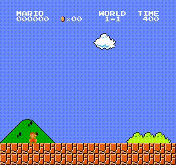

# 分析方式
> 这里提供一种分析方式，目的是告诉同学们从哪个角度进行分析并进行改进，写报告的时候不必要写得这么详细，自由发挥，言之有理即可。

- 程序运行获得模型checkpoint后，使用`tensorboard`与`evaluate.py`来获取训练曲线、可视化以及分类激活映射视频（Class Activation Mapping, CAM）

- 这里以baseline训练到3M steps时3个seed的结果为例：

## 1. 首先查看tensorboard
比较推荐是看SCALARS

### 1.1. 最重要的是查看 evaluator_step/reward_mean：

平均是在1700分，由于3000才是通关，所以还有比较大的差距。

再分别看看不同的seed情况：

可以看出所有seed，尤其是绿线，很明显还在增长，因此如果继续训练应该会有更好的效果（但这里受限于计算资源，只比较3M steps时的性能）。
但从反面来讲，3M这个性能说明学习速度过慢，看看曲线，从0~800k steps左右基本上什么也没学到，在1M~2.5M steps之间是非常长的一段平台期，为什么学习太慢呢？从多个角度出发：
- 首先是观测空间
  - 现在观测空间虽然已经进行Resize以及Normalization，但是图像上没有用的信息还是太多，例如天空中的白云、马里奥的外观形状信息等，这些对于决策而言都是冗余的信息；神经网络需要从这些冗余的信息中找出有价值的信息是需要时间的，拖慢了训练速度。因此是否可以考虑去除这些冗余信息，提升输入的信息密度呢？所以考虑去除天空以及降采样，应该能有助于学习。对应的就是更换游戏版本从`v0`到`v1\2\3`；
  - 考虑了多余的信息，那么是否有信息被漏掉呢？思考一下，现在网络的输入是当前帧的图像，但是相较于游戏的视频画面，图像实际上是损失了物体运动的速度以及加速度的，此时智能体的决策是没法只根据当前帧的信息做出（单帧mario游戏不符合马尔科夫性）；设想一下，当你在跳跃到空中时，你当前的速度大小决定了你是否要继续按住向右键（速度太快可能冲过了头撞到怪物，速度太慢可能调入深坑）；同时怪物当前移动的速度方向也是非常重要的信息，这些在单帧图像中都是不可见的。解决办法是将连续多帧的图像合并在一起作为网络的输入，来作为弥补。对应的就是 `FrameStackWrapper`，操作过程中将 `-o 1` 换为 `-o 4`即可将四帧堆叠作为输入。（实际上这个问题更好的解决方案应该是加入光流OpticalFlow或者使用循环神经网络RNN，但是限于算力因素就暂且不开展实验了）
- 其次是动作空间
  - 对于每一个状态，智能体都需要尝试7个动作的好坏来找出好的动作并提升它的概率，这个探索过程比较漫长，能否降低探索空间的维度呢？事实上7个动作中间，最有用的动作就是向右以及跳跃（至少对于1-1关卡是如此，这里引入了归纳偏置，这也是让同学们自己玩一玩游戏的原因），如果只有这两个动作，探索效率会大大提升。对应的就是将动作从 `SIMPLE_MOVEMENT` 更改为 `[['right']['right', 'A']]`，操作过程中将 `-a 7` 换为 `-a 2` 即可。（事实上减小操作空间维度可能会降低操作上限，甚至有些关卡向左的动作无法通关。但是在训练初期应该是能够加速收敛的）
    - 这里有一个智能体使用向左的动作躲避怪物的例子，如果你修改为只有两个动作，则这样的操作根本做不出来。这个智能体同样是baseline训练出来的，seed设置为2。
    - 
- 最后是奖励空间
  - 能否设计比[当前奖励机制](https://github.com/Kautenja/gym-super-mario-bros)更好的奖励机制来帮助智能体学习？

### 1.2. 辅助信息 learner_step/q_value_avg

展示的是训练过程中的Q值信息，一般而言越高越好，这里也可以看到是还在增长的，说明继续训练应该会有更好的结果。

### 1.3. 辅助信息 learner_step/loss_avg

对于监督学习任务而言，loss是决定网络是否收敛的最重要的信息之一，但是对于强化学习算法DQN，由于采用的是自举Bootstrapping来提供监督信号，虽然大体而言还是越低越好，但损失会非常不稳定，一般而言不会过于关注。

### 1.4. 辅助信息 collector_step/avg_envstep_per_sec

意思是每一秒钟，收集到的transitions（一个step一个transition）的数量。如果训练过程中发现训练速度很慢，那么可以从这里看看是否是由于收集数据过慢（这里更多的是靠CPU性能）

### 1.5. 辅助信息 buffer_sec

意思是每一秒钟replay buffer的增删取的情况，同理可以看看是否是由于存入和采样数据过慢（这里更多的是靠CPU和内存性能）

## 2. 查看可视化视频

发现最后智能体会卡在砖块上无法动弹直到超时。

智能体卡在砖块上看起来是一直采取的某一个动作（事实上输出这个动作并不是一定向右，可能是向右+跳跃或别的动作，之所以会被卡住是游戏机制的原因），导致被卡住，这个现象发生的原因是智能体在这里没有尝试其它的动作：
1. 由于这里已经是游戏后期了，所以这里的经验会比较少（直到训练了一段时间后智能体才能可能探索到这里，一开始训练的时候智能体在前面就被卡住或者死亡了），导致智能体没有试出来这里的可以跳过去的动作或动作组合；
2. 同时另一个原因是深度Q网络（DQN）是确定性（Deterministic）策略，即通过取 $a = \argmax Q$ 来决策，导致相同的输入肯定得到相同的输出，卡住后这里除了右上角的时间外，状态基本上是相同的，导致会一直输出某一个动作，而这一个动作会导致被卡住，从而状态又得不到更新，因此形成了闭环。

那么针对以上两个原因就可以得到解决办法：
1. 针对第一个问题：方法是加强探索，即加长训练探索时间，或者增加探索效率（回到了从特征空间上做改进，详见前面的分析），或者换用探索能力更强的强化学习算法；
2. 针对第二个问题：方法是增加随机性，即换用随机性（Stochastic）的强化学习算法，可以是不用DQN了，换用基于策略的算法，但更简单的是在决策过程中加上一些扰动，例如在评估过程中也采用epsilon-greedy算法。很显然后者实现起来更加简单，事实上它是可行的，但是代价是有概率变得更糟，即由于决策有随机性的因素，导致智能体在前面就挂掉了。

## 3. 查看类别激活映射（Class Activation Mapping, CAM）视频

关于CAM的理解可以看[这里](https://zhuanlan.zhihu.com/p/269702192)。

CAM可以可视化图像中每一部分对于网络输出的贡献，视频中颜色越红的地方即对当前帧的决策贡献越大。可以发现每一帧中图像激活点都在不断闪动，这是由于每一帧智能体的决策不同导致的，即向上跳、向右等动作关注的地方不一样，视频中是把拿出来执行的动作的关注点可视化了。

大体上而言可以发现智能体主要关注柱子、云朵、砖块、怪物等，这和预期大致是相同的。

然而云朵的信息实际上不希望智能体多加关注，因此将游戏版本换为`v1`也许能有效提升性能。